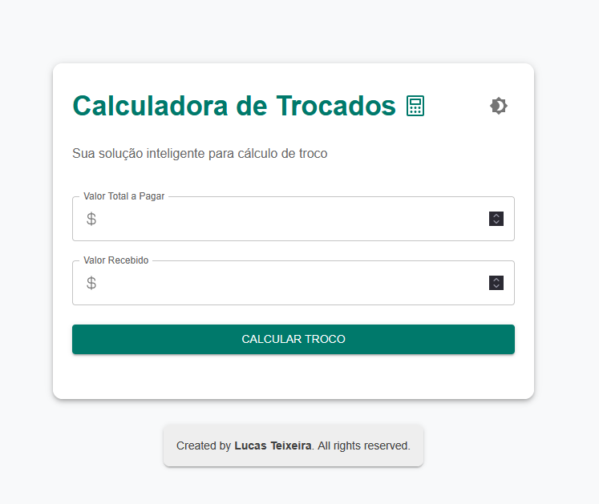
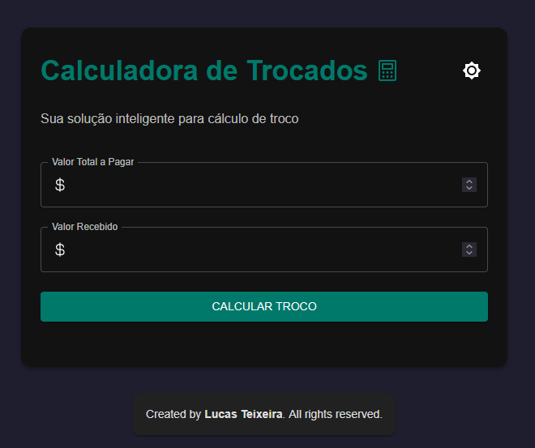

# 💰 Calculadora de Trocado

**Calculadora de Trocado** é uma aplicação React desenvolvida para ajudar no cálculo de troco de forma rápida e eficiente. O projeto utiliza **Vite** para um ambiente de desenvolvimento moderno e rápido, além de **Material-UI** para estilização e componentes.

---

## 🚀 Funcionalidades

- **Cálculo de Troco**: Insira o valor total e o valor recebido, e a aplicação calculará o troco ideal.
- **Detalhamento do Troco**: Exibe as denominações (notas/moedas) e suas respectivas quantidades.
- **Impressão de Recibo**: Gere e imprima um recibo formatado com os detalhes do troco.
- **Modo Claro/Escuro**: Alterne entre os temas claro e escuro para uma melhor experiência visual.
- **Formatação Automática**: Os valores inseridos são automaticamente formatados com duas casas decimais ao perder o foco.

---

## 🛠️ Tecnologias Utilizadas

- **React**: Biblioteca JavaScript para construção de interfaces de usuário.
- **Vite**: Ferramenta de build rápida para desenvolvimento moderno.
- **Material-UI (MUI)**: Biblioteca de componentes para estilização.
- **TypeScript**: Linguagem principal do projeto.
- **HTML/CSS**: Para estrutura e estilização básica.

---

## 📂 Estrutura do Projeto

```plaintext
trocados-ia/
├── public/
│   ├── calculator-icon.png   # Ícone do site
│   └── [index.html](http://_vscodecontentref_/0)            # Arquivo HTML principal
├── src/
│   ├── App.tsx               # Componente principal da aplicação
│   ├── main.tsx              # Ponto de entrada do React
│   ├── App.css               # Estilos específicos do App
│   ├── index.css             # Estilos globais
│   └── assets/               # (Opcional) Recursos adicionais
├── [vite.config.js](http://_vscodecontentref_/1)            # Configuração do Vite
├── package.json              # Dependências e scripts do projeto
├── tsconfig.json             # Configuração do TypeScript
└── [README.md](http://_vscodecontentref_/2)                 # Documentação do projeto


GitHub Copilot
Aqui está um README.md detalhado e bem formatado para o seu projeto Calculadora de Trocado:

🖥️ Como Executar o Projeto
Pré-requisitos
Node.js (versão LTS recomendada)
npm ou yarn instalado
Passos
Clone o repositório:

Instale as dependências:

Inicie o servidor de desenvolvimento:

Acesse no navegador:

O projeto estará disponível em: http://localhost:3000
🧾 Funcionalidades em Detalhes
1. Cálculo de Troco
Insira o valor total e o valor recebido.
Clique no botão "Calcular Troco" para obter o troco ideal.
2. Detalhamento do Troco
Exibe as denominações (notas/moedas) e suas respectivas quantidades.
3. Impressão de Recibo
Clique no botão "Imprimir Recibo" para gerar um recibo formatado com os detalhes do troco.
4. Modo Claro/Escuro
Alterne entre os temas claro e escuro clicando no ícone de tema no canto superior direito.
5. Formatação Automática
Os valores inseridos nos campos de entrada são automaticamente formatados com duas casas decimais ao perder o foco.
🎨 Estilo e Design
Modo Claro: Fundo off-white com texto escuro.
Modo Escuro: Fundo cinza escuro com texto claro.
Responsivo: Layout adaptado para diferentes tamanhos de tela.
🛡️ Licença
Este projeto está licenciado sob a MIT License. Sinta-se à vontade para usá-lo e modificá-lo conforme necessário.

✨ Autor
Desenvolvido com ❤️ por Lucas Teixeira.

GitHub
LinkedIn


Adicione capturas de tela do projeto para ilustrar as funcionalidades.

📚 Referências
React
Vite
Material-UI